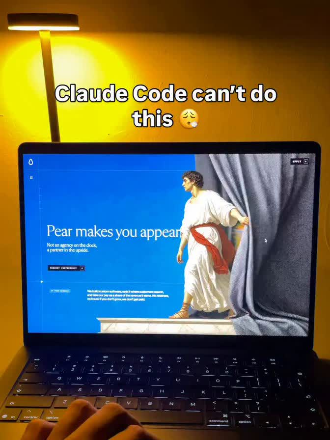
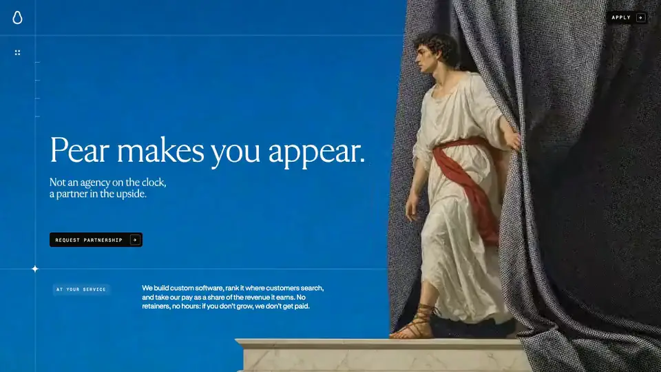
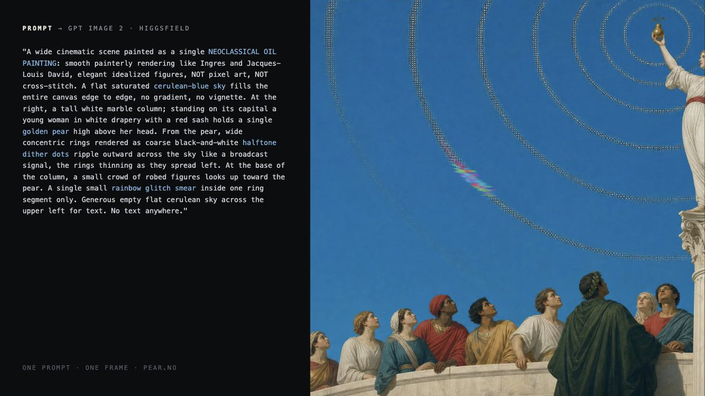

# CLAUDE CODE CAN DO THIS.

[pear.no](https://pear.no/) went viral as “the coolest website on the internet.”

And wherever it appeared, the same false claim followed:

> “Claude Code can’t do this.”

  

But Pear publicly described its production stack as GPT Image 2 stills, Seedance 2 films, and Fable 5 in Claude Code. No Figma.

So this repository is the answer:

## Claude Code can actually do this.

  

[Live reconstruction](https://oosuhada.github.io/pear.no/)

## From prompt to production

  

The reconstruction preserves the cinematic, scroll-driven WebGL experience while rebuilding its loading and frame-delivery system for smoother navigation.

This is an independent technical study and is not affiliated with Pear AS. The original concept, art direction, branding, copy, and media belong to their respective creators and owners.
